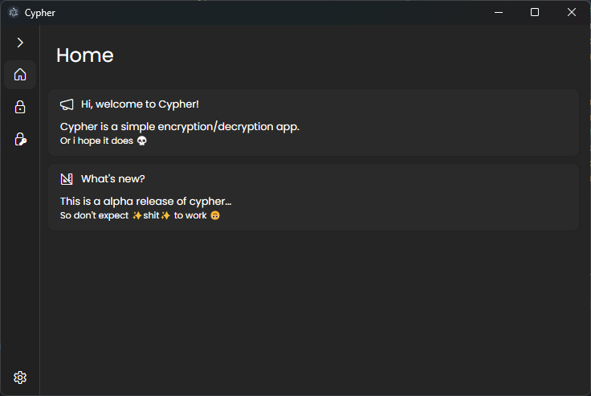

# Cypher




## Libraries

- React
- Emotion
- framer-motion
- Electron
- Vite

## Icons

- Segoe Fluent Icons

## Running this app

1. Clone this repository

```sh
git clone https://github.com/MateuszPerczak/cypher
```

2. Install all dependencies

```sh
yarn
```

3. Start react development server and app

```sh
yarn dev
```

OR if you want to build it

```sh
yarn build:win
```